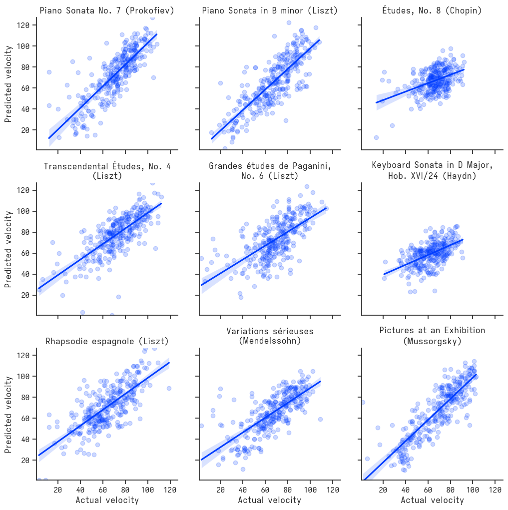
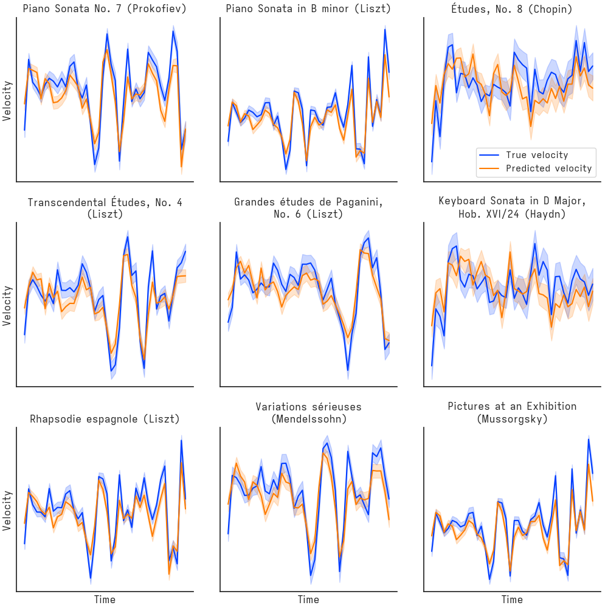

# midihum

midihum (the tool formerly known as rachel) is a command-line tool for humanizing MIDI -- that is, for taking as input MIDI compositions with constant velocities (flat loudness/dynamics) and producing as output those same compositions with new velocity (loudness/dynamics) values for each of the contained notes.

This tool requires Python 3. It has been tested on macOS Ventura 13.0.1 and Debian GNU/Linux 5.10.178-3.

## Usage

Using midihum is easy. First clone the repository, navigate to the midihum/ directory, and install dependencies:

```shell
pip install -r requirements.txt
```

Then -- making sure you're still in the midihum/ directory -- simply:

```shell
python main.py humanize /path/to/file.mid /path/to/humanized_file.mid
```

## Performance

The midihum program performs surprisingly well, at least for solo piano works of roughly the type it was trained on, i.e., from the Baroque, Classical, and especially Romantic periods of Western art music. Here are the true velocities and the predicted velocities for nine randomly chosen, not-cherry-picked performances from the validation set:



In the above plot, each dot is a note on event, randomly sampled from the piece. For the same nine pieces, the model also captures the dynamics over the course of the composition well:



## Model

The program uses [XGBoost](https://xgboost.readthedocs.io/en/stable/) gradient boosted trees for its model, where each observation is one MIDI note on event (see `midihum_model.py`), with a large (~400) set of derived features (see `midi_to_df_conversion.py`).

## Acknowledgements

The model is trained on 2,579 performances from the International Piano-e-Competition for pianists aged 35 and under. The midihum tool is dedicated to those talented young performers.
