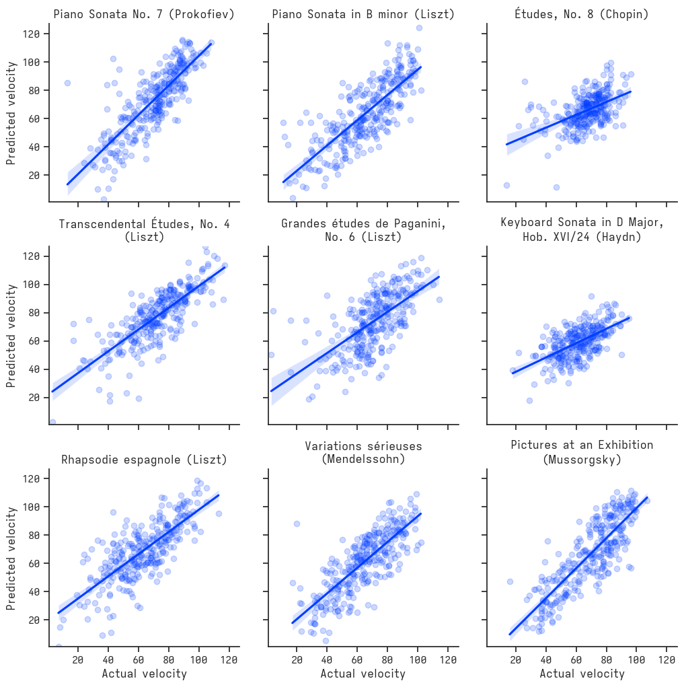
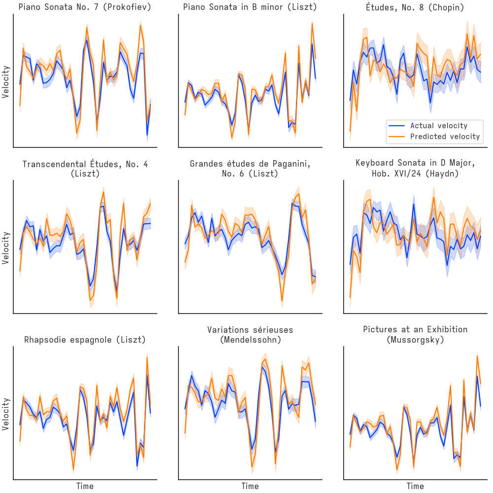

# midihum

midihum (the tool formerly known as rachel) is a command-line tool for humanizing MIDI -- that is, for taking as input MIDI compositions with constant velocities (flat loudness/dynamics) and producing as output those same compositions with new velocity (loudness/dynamics) values for each of the contained notes.

This tool requires Python 3. It has been tested on macOS Ventura 13.0.1 and Debian GNU/Linux 5.10.178-3.

## How does one use this?

Using midihum is easy. First clone the repository, navigate to the midihum/ directory, and install dependencies:

```shell
pip install -r requirements.txt
```

Then -- making sure you're still in the midihum/ directory -- simply:

```shell
python main.py humanize /path/to/file.mid /path/to/humanized_file.mid
```

## How well does it work?

Surprisingly well, at least for solo piano works. Here are the true velocities and the predicted velocities for nine randomly chosen, not-cherry-picked performances from the validation set:



For the same nine pieces, the model captures the dynamics over the course of the composition well:



## How does the model look?

The program uses [XGBoost](https://xgboost.readthedocs.io/en/stable/) gradient boosted trees for its model, where each observation is one MIDI note on event (see `midihum_model.py`), with a large (~1K) set of derived features (see `midi_to_df_conversion.py`).

## Acknowledgements

The model is trained using data from the International Piano-e-Competition. The midihum tool is dedicated to those talented young performers.
